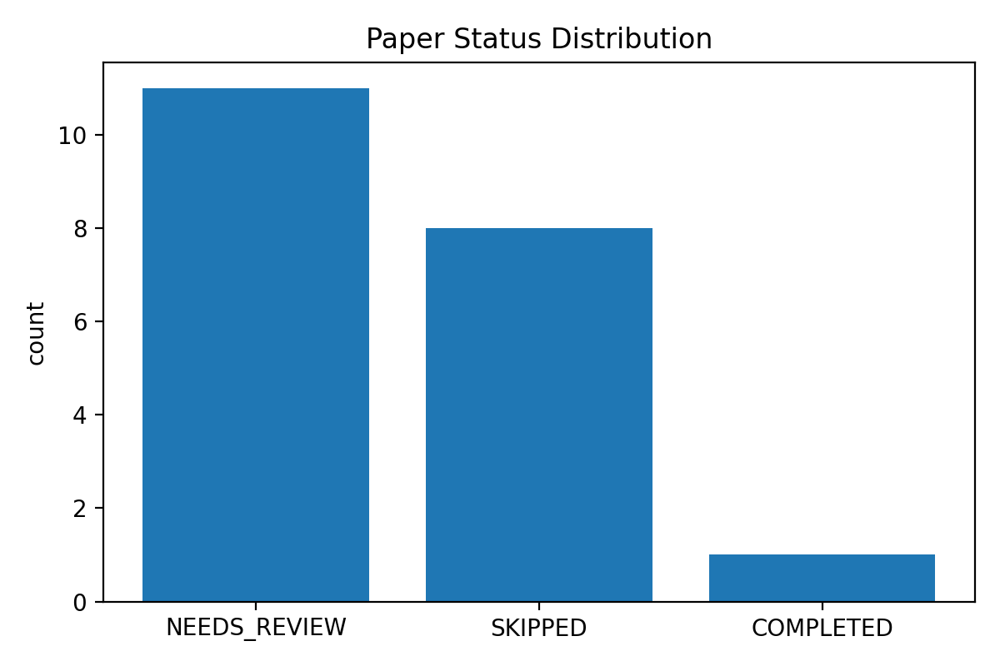
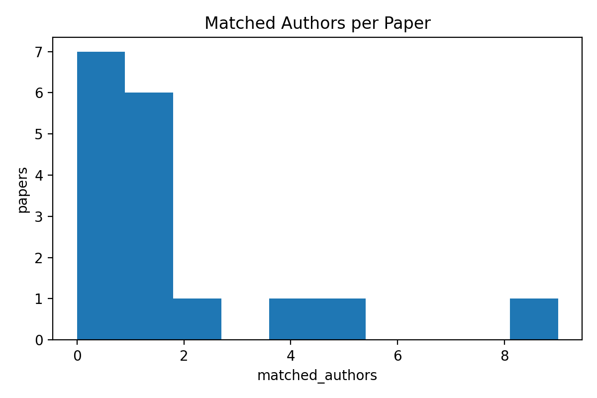

## 二、项目摘要（≤200字）
面向高校科研成果统计，MAC-ADG 以 Scout–Vision–Judge 多智能体（MAS）+ FSM 实现 DOI 批处理闭环。通过 DPI 增强与自适应 ROI 感知完成角标/脚注的像素级对齐，结合贝叶斯仲裁与 CoT 假设检验消解多源冲突，并预留 RAG 记忆支持人机回环自进化。已沉淀 50 DOI 验证集与 sidecar 审计资产，稳定产出作者—单位—权益元数据。

---

## 三、项目主要进展（全周期深度总结）

### 3.1 对标申报书：关键科学问题—工程化闭环验证
申报书明确三类关键科学问题：
- **问题 1.1 视觉-语义对齐与零样本认知**：复杂版面下二维视觉特征到一维语义结构的可逆映射。
- **问题 1.2 多源冲突博弈与概率推理**：API 结构化证据与视觉证据不一致时的可信度量化与可解释裁决。
- **问题 1.3 人机回环与长效记忆**：将人工纠错沉淀为可复用经验，形成系统自进化。

本阶段工作以“**可跑通、可审计、可扩展**”为第一目标，完成了从理论蓝图到工程系统的关键落地，形成了面向真实站点的端到端闭环：
- 输入：DOI 清单（支持批量）+ 教职工名录（姓名/工号/学院/部门）。
- 过程：Scout（API 侦察）→ Perception（网页截图/hover/ROI/OCR）→ Judge（证据仲裁与身份审计）→ Evolution（入库与导出）。
- 输出：论文级状态（COMPLETED/NEEDS_REVIEW/SKIPPED/ERROR）+ 作者级结构化元数据（单位、角标、通讯/共一证据）+ 审计 sidecar。

### 3.2 架构落地：MAS 理论模型到 FSM 编排控制器
**(1) 从“多智能体协作”到“可控闭环”**
- 申报书提出“控制-执行-记忆”解耦。本项目工程上采用 FSM（有限状态机）作为 Orchestrator：
  - **成本优先策略**：优先调度低成本 API（Scout），仅在证据不充分时激活视觉链路（Vision），在冲突/不确定时进入仲裁（Judge）。
  - **状态收敛机制**：以论文级 status 约束流程终态，避免多站点环境下的“重试发散”。
  - **可追溯输出**：将关键中间证据（截图、OCR 文本、hover 结构化数据、裁决信号）固化为 sidecar 与数据库字段。

**(2) Scout–Vision–Judge 的分工与接口稳定化**
- **Scout（侦察智能体）**：面向 Crossref/OpenAlex 等结构化信源提供先验；其价值在于“快”和“广”，同时也暴露时效性/缺失风险。
- **Vision（视觉智能体）**：以网页截图与作者块 ROI 为主要载体，完成微小角标与单位映射的“像素级对齐”，并提供 OCR 证据链。
- **Judge（仲裁智能体）**：实现“假设—验证—决断”的 CoT 仲裁范式；当姓名相似但单位证据不足时，输出 NEEDS_REVIEW 以抑制误报。

### 3.3 视觉攻坚：自适应 ROI 动态锁定与坐标逆映射（DPI 增强）
申报书的关键创新点之一是“自适应视觉切片 + 坐标映射”。本阶段已完成工程化实现与站点级鲁棒性补齐：

**(1) 微小角标的分辨率瓶颈与 DPI 增强策略**
- 真实网页中“上标数字 / 星号 / 匕首符号”属于高频细节，整页渲染时易被压缩与抗锯齿吞噬，导致通讯/共一标记丢失。
- 通过 Playwright 渲染端的 `deviceScaleFactor`（DPI 增强）提升有效像素密度，以更低的 token/算力预算获得更高的信息增益。

**(2) ROI（作者块）二次采样：空间注意力权重的工程近似**
- Vision 引入作者块 ROI 截图作为“空间注意力权重 α 的工程近似”：在全页证据不足时对作者区进行高分辨率再采样。
- 同时保留全页 OCR 作为证据底座，ROI OCR 作为补强证据，实现“局部精读 + 全局可审计”。

**(2b) 坐标逆映射：仿射变换保证像素级对齐**
- ROI 截图在采样时记录裁剪偏移向量 T=(x_off,y_off) 与缩放因子 α，并将局部坐标系中的 OCR BBox 通过仿射变换还原到全局页面坐标：P_global = M·P_local + T（M 为逆缩放矩阵）。
- 该“可逆映射”使得通讯作者星号、上标数字等细粒度标记具备可追溯的像素级证据链，降低跨模态语义鸿沟带来的误配风险。

**(3) 折叠面板/动态渲染干扰：先展开再截图**
- 在真实站点（如 Frontiers）中，作者单位往往隐藏在 `see more / Author information & affiliation(s)` 折叠控件后。
- 已将“best-effort 展开”前置到**截图/ROI 截图阶段**，从源头降低 OCR 读入 UI 噪声（Views/Downloads/Outline 等），提升单位映射可用性。

### 3.4 逻辑仲裁：基于教师名录的身份审计协议与可解释裁决
申报书提出“多源证据权重仲裁”。本阶段以可审计为中心构建身份协议，重点解决“同名异人/同名异校/挂名单位”的科研管理痛点：

**(1) 身份审计协议（Name + Affiliation 双阈值）**
- **规则底线**：姓名相似并不足以确认归属，必须满足“姓名证据 + 单位证据”双一致；否则进入 NEEDS_REVIEW。
- 该策略实质上是在工程上引入“误报成本”先验：宁可召回下降，也要压制错误归属（面向绩效统计尤其关键）。

**(2) match_signals：把裁决过程结构化**
- 将仲裁所依据的证据与结论写入 `paper_authors.match_signals`，形成可复核的“证据链”。
- 典型信号包括：name_only_candidate（姓名像但单位不足）、school_affiliation_hit（单位命中学校关键词）、corresponding markers（星号/邮件图标等）。

**(3) 终态管理：论文级 status 的闭环控制意义**
- 论文级 status 作为 FSM 的收敛条件：
  - **COMPLETED**：证据链闭合且一致。
  - **NEEDS_REVIEW**：姓名像但单位 Unknown（证据不足，触发人审）。
  - **SKIPPED**：姓名像但单位不一致（高风险误报，主动排除）。

### 3.5 数据资产：50 篇 DOI 验证集 + Sidecar 审计资产沉淀
申报书强调“可复现、可审计”的科研方法论。本阶段已形成可复用数据资产：
- **DOI 实验验证集**：以 `doi_table.csv` 维护 50 篇样本及标注字段（是否川大作者/共一/通讯作者等）。
- **Sidecar 证据资产**：每篇 DOI 自动生成截图与结构化 sidecar（例如 `*_page_author_data.json`、`*_author_roi.png`、OCR sidecar），沉淀在 `data/visual_slices/`，支持抽样复核与错误模式归因。
- **可交付证据包**：提供脚本自动导出中期检查所需的表格、图表、运行耗时与配置快照（适配“数据导向”的检查口径）。

### 3.6 实验与指标（数据化快照：来自证据包 run_config.json）
为体现“数据导向 + 可复现”，系统在 2026-04-13 进行一次 20 DOI 子集的端到端批跑并自动生成证据包，关键统计如下：
- **证据包目录（可直接引用）**：`data/exports/maturity_pack_20260413_135312/`
- **审计 sidecar 目录（可直接引用）**：`data/visual_slices/`
- **样本规模**：DOI=20；教师名录=152。
- **运行效率**：平均耗时 108.0 s/篇；P90 耗时 179.2 s/篇（run_times 统计）。
- **结果分布**：Top1 状态为 NEEDS_REVIEW（11/20），体现“高置信度优先、低置信度进入人审”的保守策略。
- **校内作者线索（doi_table 标注统计）**：含川大作者论文 10/20（50.0%）；通讯标记 6；共一标记 3。
- **抽取质量（DB 统计）**：单位非 Unknown 比例 100.0%（149/149）；平均作者数 8.76；平均匹配到教师库作者数 1.53。

补充：识别正确率（Ground Truth 一致性评测）
- **运行成功率**：20/20=100%（见 `data/exports/maturity_pack_20260413_135312/run_times.csv`）。
- **作者条目覆盖率**：17/20=85%（见 `data/exports/maturity_pack_20260413_135312/per_paper_summary.csv`；缺失 DOI：10.1007/s00134-023-07050-7、10.1038/s41587-022-01618-2、10.1038/s41586-024-07487-w）。
- **论文级命中（是否识别到名单川大教师）**：Accuracy=100%（TP=10, FP=0, TN=10, FN=0）。
- **作者级名单匹配（真值阳性论文）**：Precision=96.15%，Recall=86.21%，F1=90.91%（TP=25, FP=1, FN=4）。
- **通讯作者标记（真值阳性论文）**：Precision=100%，Recall=66.67%，F1=80%（TP=4, FP=0, FN=2）。
- **共一标记（真值阳性论文）**：Recall=0%（TP=0, FN=3；作为 Error Case 记录，后续迭代重点攻坚）。

上述评测结果已固化为可截图证据表：
- `data/exports/maturity_pack_20260413_135312/ground_truth_eval_summary.csv`
- `data/exports/maturity_pack_20260413_135312/ground_truth_eval_per_doi.csv`

补充：ROI 消融（A/B）结果（同一 5 DOI 子集，tag: 20260413_194120）
- **ROI 关闭（对照组）证据包**：`data/exports/maturity_pack_ablation_roi0_20260413_194120/`
- **ROI 开启（实验组）证据包**：`data/exports/maturity_pack_ablation_roi1_20260413_194120/`

关键对比（Ground Truth 一致性评测 + 运行效率）：
- **论文级命中 Accuracy**：100.00%（5/5）→ 80.00%（4/5）（-20.00pp）
- **作者级名单匹配 F1**：97.30% → 84.85%（-12.45pp）
- **通讯作者标记 Recall**：80.00%（4/5）→ 60.00%（3/5）（-20.00pp）
- **共一标记 Recall**：50.00%（1/2）→ 100.00%（2/2）（+50.00pp）
- **平均耗时**：22.32s/篇 → 40.99s/篇（+83.7%）

代表性 error case（用于讨论与后续迭代）：
- ROI 开启导致论文级 FN：`10.1038/s41467-023-42720-6`（pred_has_scu=N），漏识别：Cheng Gu; Shengdong Wang。
- ROI 开启作者漏识别：`10.1038/s41392-022-01130-8` 漏识别：Jun Shao; Weimin Li。

结论（写法建议）：ROI 强制开启在该子集上提升了共一标记召回，但引入了作者漏识别与论文级漏报，并显著增加耗时；工程上更推荐“自适应 ROI”（证据不足时启用，且 ROI 导致匹配下降时回退）。

---

## 四、下一步工作计划（至 2026 年 10 月）

### 4.1 技术维度：RAG 记忆模块集成与长效自进化实测
- **目标对标（问题 1.3）**：把人工审核的纠错对（错误→修正）向量化，形成可检索的“纠错案例库”。
- **关键实现**：
  - 设计三元组记忆单元 `<LayoutFingerprint, ErrorPattern, Correction>`，支持跨站点的类比迁移。
  - 在 Judge 仲裁阶段加入“历史相似案例 Top-K”动态提示注入，形成“人机回环→经验沉淀→提示增强”的闭环。
- **验收指标**：长尾错误复发率下降（同类版面错误二次出现时自动命中修复策略）。

### 4.2 测试维度：1000+ 站点压力测试与精度消融实验
- **规模化压力测试**：扩展到 1000+ 不同期刊站点/出版商页面，统计成功率、超时率、阻断率（cookie/人机验证）。
- **消融设计**：
  - 关闭/开启 ROI、DPI、hover 展开等模块，量化对通讯/共一识别率、单位完整率的增益（Capability Increment）。
  - 对比仅 API（Scout-only）与 Vision+Judge 融合（Fused）的差异，刻画跨模态语义鸿沟的收敛程度。

### 4.3 成果维度：文档体系、软著与结题材料
- **文档整理**：形成“技术路线—接口参考—测试指南—数据字典—复现实验”一体化文档。
- **软著准备**：梳理模块边界（Orchestrator/Agents/WebDriver/OCR/DB/前端），准备软件著作权材料。
- **结题验收**：整理代表性案例（2–3 篇）形成“可解释证据链”展示：截图 + sidecar + DB 记录 + 报表输出。

---

## 四、经费使用情况和经费安排计划

### 现状
- 目前项目核心投入以**软件研发与数据采集**为主，依赖开源组件与本地计算资源。
- 经费使用建议按学校财务口径据实填报（建议以“设备/计算资源、数据采集与存储、差旅与调研、打印与材料、劳务/咨询”等科目归类）。

### 计划
- **计算与存储**：用于批量站点测试的算力与存储（截图/sidecar 资产增长）。
- **数据采集与合规**：用于站点访问的网络与安全合规支出（如必要的访问授权/合规审计）。
- **科研产出**：用于软著申请材料、测试报告打印装订、对外交流与调研。

---

## 五、存在问题、建议及需要说明的情况

### 5.1 技术瓶颈（真实痛点复盘）
- **跨行角标误吸附**：上标数字易与相邻作者行粘连，造成 affiliation_numbers 误配；需进一步引入“局部几何一致性约束”（基于 bbox 的空间邻近与同一行判别）实现像素级对齐增强。
- **复杂动态页面渲染干扰**：cookie 弹窗、折叠控件、异步加载导致“可见性”与“可截取性”不一致；已通过“先展开再截图”的策略缓解，但对强交互站点仍需更精细的 DOM 状态机。
- **反爬/人机验证**：个别出版商会触发验证页面，导致截图失败；需建立阻断检测与降级策略（例如仅保留 API 证据并标注 NEEDS_REVIEW）。

### 5.2 工程挑战与对策
- **多环境依赖差异**：OCR/Paddle 生态对环境敏感（模型初始化耗时、版本兼容）；建议将 OCR 引擎做单例缓存、并提供轻量模式开关，降低批跑抖动。
- **采集模块体量膨胀**：针对不同站点的适配逻辑易碎片化；建议提炼“通用策略层（展开/滚动/等待/ROI）+ 站点插件层”的分层结构，降低维护成本。
- **可复现与可审计要求提升**：随着样本扩展到 1000+，需要统一 sidecar schema 与数据字典，确保每条裁决都能回溯证据与参数快照。

### 5.3 建议与需说明事项
- 建议中期检查采用“证据包”提交：DOI 清单、运行耗时、状态分布图、身份审计表、代表性 sidecar 截图（体现数据导向与逻辑闭环）。
- 建议同步建立小规模人工复核机制（Human-in-the-loop），为后续 RAG 记忆与自进化提供高质量纠错样本。

---

## 附录：附件与证据索引（可直接截图/引用）
> 使用方式：以下均为项目根目录下**相对路径**。在 VS Code 打开对应文件后即可截图；PNG 可直接插入报告；CSV/JSON 可截图表头与前若干行作为“数据证据”。

### 附件 A：可复现性与运行记录（Run Evidence）
- **A1 运行配置快照（参数/环境/统计）**：`data/exports/maturity_pack_20260413_135312/run_config.json`
- **A2 本次批处理 DOI 清单**：`data/exports/maturity_pack_20260413_135312/dois.txt`
- **A3 逐 DOI 耗时与终态（可做运行稳定性证据）**：`data/exports/maturity_pack_20260413_135312/run_times.csv`
- **A4 ROI 消融配置快照（ROI 关闭）**：`data/exports/maturity_pack_ablation_roi0_20260413_194120/run_config.json`
- **A5 ROI 消融配置快照（ROI 开启）**：`data/exports/maturity_pack_ablation_roi1_20260413_194120/run_config.json`

### 附件 B：三组数据表（CSV，可直接引用为表格证据）
- **B1 论文终态分布表（A1 对应）**：`data/exports/maturity_pack_20260413_135312/status_summary.csv`
- **B2 每篇论文作者/匹配统计（A2 对应）**：`data/exports/maturity_pack_20260413_135312/per_paper_summary.csv`
- **B3 身份审计表（C1 对应）**：`data/exports/maturity_pack_20260413_135312/identity_audit.csv`
- **B4 能力增量对比模板（B1 对应）**：`data/exports/maturity_pack_20260413_135312/capability_increment.csv`
- **B5 真值一致性评测汇总（正确率/召回率/F1）**：`data/exports/maturity_pack_20260413_135312/ground_truth_eval_summary.csv`
- **B6 真值一致性评测逐 DOI 对照表**：`data/exports/maturity_pack_20260413_135312/ground_truth_eval_per_doi.csv`
- **B7 ROI 消融对比结论（A/B，含差异表）**：`data/exports/maturity_pack_ablation_roi1_20260413_194120/roi_ablation_summary.md`
- **B8 ROI 消融差异表（Δ，CSV）**：`data/exports/maturity_pack_ablation_roi1_20260413_194120/roi_ablation_delta.csv`
- **B9 ROI 消融真值评测汇总（ROI 关闭）**：`data/exports/maturity_pack_ablation_roi0_20260413_194120/ground_truth_eval_summary.csv`
- **B10 ROI 消融真值评测汇总（ROI 开启）**：`data/exports/maturity_pack_ablation_roi1_20260413_194120/ground_truth_eval_summary.csv`

### 附件 C：图表证据（PNG，可直接插图）
- **C1 论文终态分布（对应 B1）**：`data/exports/maturity_pack_20260413_135312/status_distribution.png`
- **C2 每篇论文匹配作者条目数分布（对应 B2）**：`data/exports/maturity_pack_20260413_135312/matched_authors_hist.png`

### 附件 D：页面级 sidecar 审计（代表性 DOI 示例，可截图“原始证据链”）
> 命名规则：将 DOI 中的 `/` 替换为 `_` 作为文件前缀（safe_doi）。

- **D1 示例 DOI：10.1038/s41586-023-05769-3（截图 + ROI + hover + OCR 证据链）**
  - 页面截图：`data/visual_slices/10.1038_s41586-023-05769-3.png`
  - 作者块 ROI：`data/visual_slices/10.1038_s41586-023-05769-3_author_roi.png`
  - hover/面板结构化数据：`data/visual_slices/10.1038_s41586-023-05769-3_page_author_data.json`
  - OCR sidecar（含 OCR 文本片段 + BBox）：`data/visual_slices/10.1038_s41586-023-05769-3_ocr_sidecar.json`

- **D2 示例 DOI：10.3389/fimmu.2022.863640（动态折叠页：截图 + ROI + hover 证据）**
  - 页面截图：`data/visual_slices/10.3389_fimmu.2022.863640.png`
  - 作者块 ROI：`data/visual_slices/10.3389_fimmu.2022.863640_author_roi.png`
  - hover/面板结构化数据：`data/visual_slices/10.3389_fimmu.2022.863640_page_author_data.json`

### 附件 E：引用模板（可直接复制到中期检查正文）
- **证据包引用**：本次实验的可复现证据包位于 `data/exports/maturity_pack_20260413_135312/`，包含运行配置（A1）、逐 DOI 运行耗时（A3）、三组数据表（B1–B4）与图表（C1–C2）。
- **原始证据链引用**：代表性 DOI 的“截图—ROI—hover—OCR”证据链见 `data/visual_slices/`（示例 D1、D2）。
