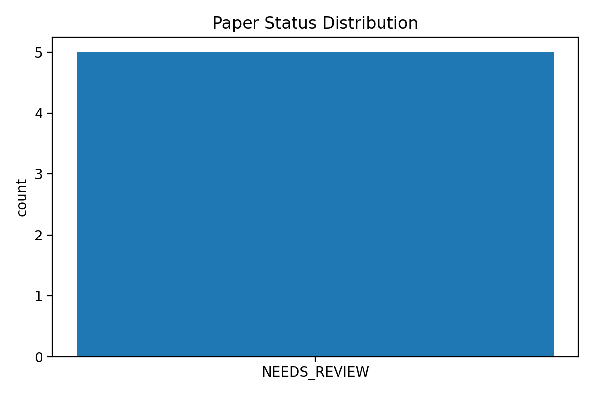
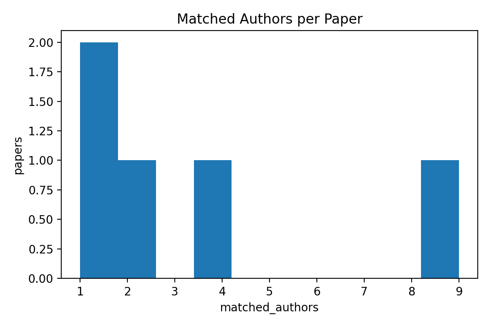

## 成熟度 5 级：规范实验与 SI 证明（至少 3 组数据/表格 + 采集说明）

本阶段强调实验的可复现性与可审计性。我们将证据分为三组数据包（每组均可导出 CSV，并由系统生成图表/截图 sidecar 作为审计材料）。

### 5.1 数据组 A：样本与元数据一致性（doi_table + DB）
- 表 A1（status_summary.csv）：论文终态分布（COMPLETED / NEEDS_REVIEW / SKIPPED / ERROR）。
- 表 A2（per_paper_summary.csv）：每篇论文的作者条目数、匹配到教师库的条目数、待复核条目数等。

### 5.2 数据组 B：能力增量验证（Scout vs Vision/hover 增强）
- 表 B1（capability_increment.csv）：对比 Scout 仅 API 元数据与 Vision/hover 增强后的结构化作者信息，量化以下指标的增量：
  - 单位完整率（non-Unknown affiliation ratio）
  - 通讯作者/共一标记可用性
  - 作者-单位映射的可解释证据（sidecar 与 match_signals）

### 5.3 数据组 C：身份审计与排除流程（staff_table + Judge 仲裁信号）
- 表 C1（identity_audit.csv）：展示疑似“挂名单位/同名异校”的作者条目，系统如何通过“姓名+单位双阈值一致”确认，或将“姓名像但单位 Unknown”的情况进入 NEEDS_REVIEW；“姓名像但单位不一致”的情况进入 SKIPPED。

### 5.4 数据采集说明（SI：参数、ROI 锚定与坐标映射）
本系统的数据采集采用“网页证据优先、OCR 兜底”的策略，并引入 ROI 动态锚定以提高角标/小字号信息的可见性。

- 浏览器内核：Playwright（Chromium）。
- DPI/缩放：Playwright 端采用 deviceScaleFactor=2（可通过环境变量 PLAYWRIGHT_DEVICE_SCALE_FACTOR 配置），以提升微小角标与上标符号的渲染清晰度。
- ROI 动态锚定：在网页截图基础上额外截取作者块 ROI（PLAYWRIGHT_CAPTURE_AUTHOR_ROI=1 时启用），将“作者行/角标区域”作为高分辨率补充证据。
- 坐标仿射映射：ROI 截取与全图共享同一页面坐标系，ROI→全图通过（x,y,w,h）偏移完成映射，保证 OCR token 可回溯到原始截图位置，实现 sidecar 可审计。
- 异构证据仲裁：Judge 以 Crossref/hover/Vision 三类证据对作者权益（通讯/共一）与单位信息进行融合，并将 match_signals 写入数据库，便于抽样复核。
- OCR 引擎：PaddleOCR（版本以 requirements.txt / 环境依赖为准），用于网页截图/ROI 的中英文 OCR 兜底识别。

### 5.5 图表（与表格对应的可视化证据）
若已安装 matplotlib，则本脚本会自动生成并保存如下图表文件（与表 A1/A2 对应）：

（若图片未生成：请在 doi 环境安装 matplotlib 后重新运行脚本：`conda run -n doi python -m pip install matplotlib`）

### 5.6 金标准一致性评估（识别正确率：doi_table 真值 vs 系统输出）
为满足成熟度 5 级“金标准（Ground Truth）+ 一致性比对”的要求，脚本会将 `doi_table.csv` 的人工标注真值与系统输出进行对齐评测，并导出两张对照表：
- ground_truth_eval_summary.csv（汇总：正确率/召回率/F1 等）
- ground_truth_eval_per_doi.csv（逐 DOI 对照：真值 vs 系统输出 + Error Case）

核心指标（若未生成，通常是 DB 缺失或未写入作者条目）：
- 论文级命中（是否识别到名单川大教师）：Accuracy=100.00%（TP=5 FP=0 TN=0 FN=0）
- 作者级名单匹配（真值阳性论文）：F1=91.43%（Precision=94.12% Recall=88.89%；TP=16 FP=1 FN=2）
- 通讯作者标记（真值阳性论文）：F1=100.00%（Precision=100.00% Recall=100.00%；TP=5 FN=0）
- 共一标记（真值阳性论文）：Recall=100.00%（TP=2 FN=0）
