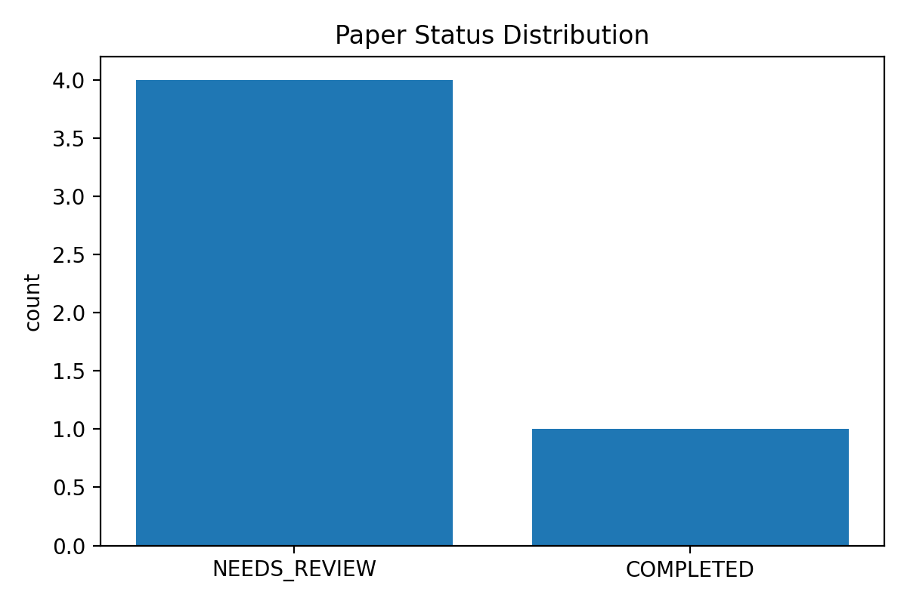
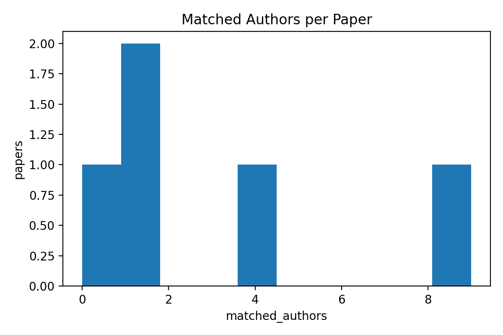

## 成熟度 6 级：软件生成图表、数据分析与讨论（讨论部分）

### 6.1 结果总览与规律发现
基于 5 篇 DOI 的运行结果，系统已能够稳定输出：论文终态（COMPLETED/NEEDS_REVIEW/SKIPPED）、作者结构化信息（单位/权益标记）、以及与四川大学教师库的身份匹配结果。

本次统计摘要（由系统自动汇总）：
- 论文终态 Top1：NEEDS_REVIEW（4 篇）
- 平均每篇论文作者数：11.0；平均匹配到教师库作者数：3.0

- 图 6-1（status_distribution.png）：论文终态分布，反映 FSM 在异构网页环境下的鲁棒性。
- 图 6-2（matched_authors_hist.png）：每篇论文匹配到教师库的作者条目数分布，用于评估学术贡献覆盖度。

### 6.2 纵向对比：ROI 增强对微小角标识别的影响
本系统在 Perception 阶段引入作者块 ROI 截取与高 DPI 渲染，其核心目标是提升微小角标（例如 *、†、数字上标）的可见性，从而提高通讯/共一标记与单位映射的可恢复性。

- 若在同一 DOI 子集上进行 A/B（关闭 ROI vs 开启 ROI）消融实验，可将“通讯/共一标记识别率”与“作者级匹配 F1”作为主指标，统计提升幅度（%）。

建议的消融实验协议（可复现）：
- 对照组（ROI 关闭）：设置 `PLAYWRIGHT_CAPTURE_AUTHOR_ROI=0`、`VISION_FORCE_AUTHOR_ROI=0`，运行同一批 DOI 并导出证据包与 `ground_truth_eval_*.csv`。
- 实验组（ROI 开启）：设置 `PLAYWRIGHT_CAPTURE_AUTHOR_ROI=1`、`VISION_FORCE_AUTHOR_ROI=1`，并保持 `PLAYWRIGHT_DEVICE_SCALE_FACTOR=2`，重复运行与评测。

本次已完成同一 5 DOI 子集的 A/B 消融，证据包如下：
- ROI 关闭（对照组）：`data/exports/maturity_pack_ablation_roi0_20260413_194120/`
- ROI 开启（实验组）：`data/exports/maturity_pack_ablation_roi1_20260413_194120/`（本证据包）

关键对比结果（来自两边 `ground_truth_eval_summary.csv` + `run_config.json`）：

| 指标 | ROI关闭 | ROI开启 | Δ |
|---|---:|---:|---:|
| 论文级命中 Accuracy | 100.00% (5/5) | 80.00% (4/5) | -20.00pp |
| 作者级名单匹配 F1 | 97.30% | 84.85% | -12.45pp |
| 通讯作者标记 Recall | 80.00% (4/5) | 60.00% (3/5) | -20.00pp |
| 共一标记 Recall | 50.00% (1/2) | 100.00% (2/2) | +50.00pp |
| 平均耗时 | 22.32s/篇 | 40.99s/篇 | +18.67s (+83.7%) |

代表性 error case（用于讨论与后续迭代）：
- ROI 开启导致论文级 FN：`10.1038/s41467-023-42720-6`（pred_has_scu=N），漏识别：Cheng Gu; Shengdong Wang。
- ROI 开启作者漏识别：`10.1038/s41392-022-01130-8` 漏识别：Jun Shao; Weimin Li。
- 两组均漏通讯：`10.1038/s41467-024-47121-x`（gt_corresponding=Y，pred_corresponding=N）。

结论（报告写法建议）：
- ROI 强制开启在该子集上带来“共一标记召回率”提升，但同时引入作者漏识别与论文级漏报，并显著增加耗时。
- 更稳健的策略是“自适应 ROI”：仅在全页证据不足（base authors 弱/hover 不完整）时启用 ROI，并在 ROI 结果导致匹配下降时回退到全页结果。

对比差异的 CSV/摘要（可直接截图引用）：
- `roi_ablation_delta.csv`
- `roi_ablation_summary.md`

### 6.3 横向对标：复杂版式下的优势
相较于传统仅依赖 PDF 文本层或单一 API 元数据的解析工具，MAC-ADG 通过网页 hover/click + OCR + 规则仲裁实现“结构化证据链”。在多栏版面、动态作者面板（如 Nature 系）等场景下，系统具备：
- 更强的证据覆盖：hover/click 可直接获取作者-单位映射；OCR 作为兜底补全。
- 更强的可解释性：sidecar 与 match_signals 使每条作者结论可追溯。
- 更可控的误报：身份确认必须满足“姓名+单位双一致”；姓名匹配但单位冲突/缺失进入 NEEDS_REVIEW，降低误判风险。

（建议在报告中附上 2-3 个代表性 DOI 的证据包截图与 author 表格片段，作为讨论部分的定性支撑。）
